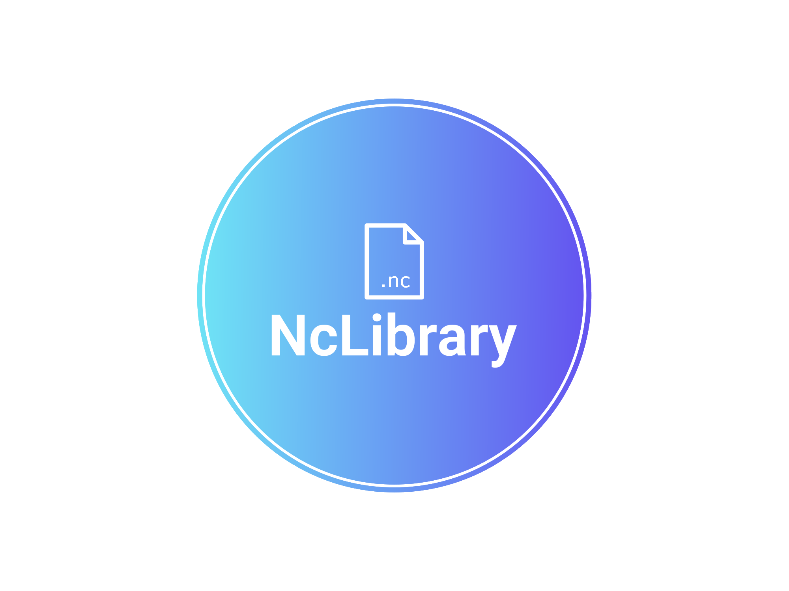

<!-- README.md is generated from README.Rmd. Please edit that file -->

# NcLibrary 

This is a R library aimed to request and manipulate data from ERA5 global atmosphere reanalysis and ECAD daily data.

